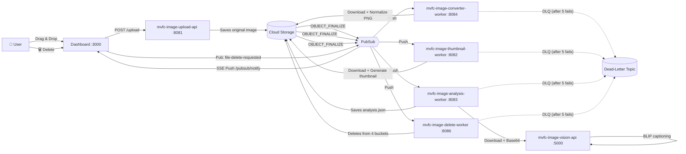
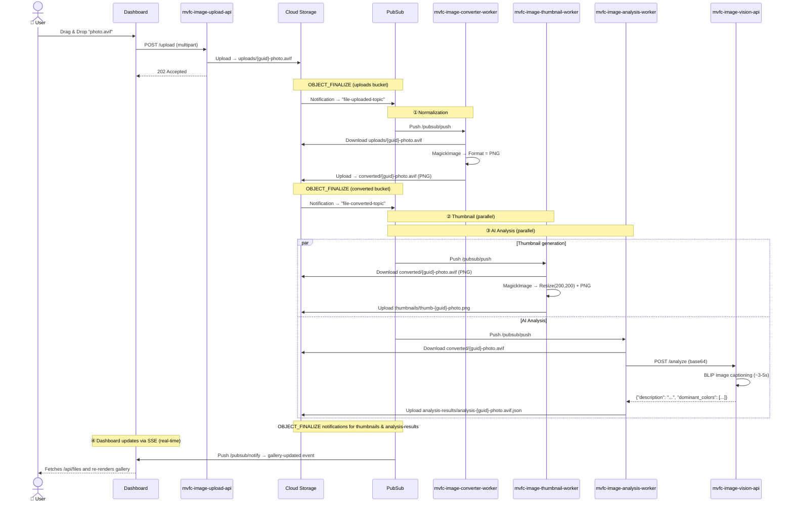
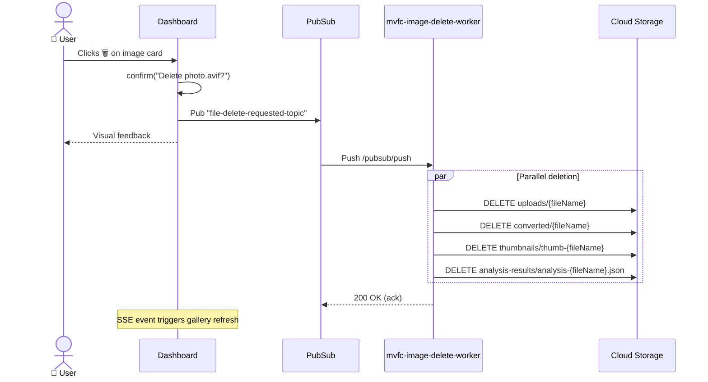
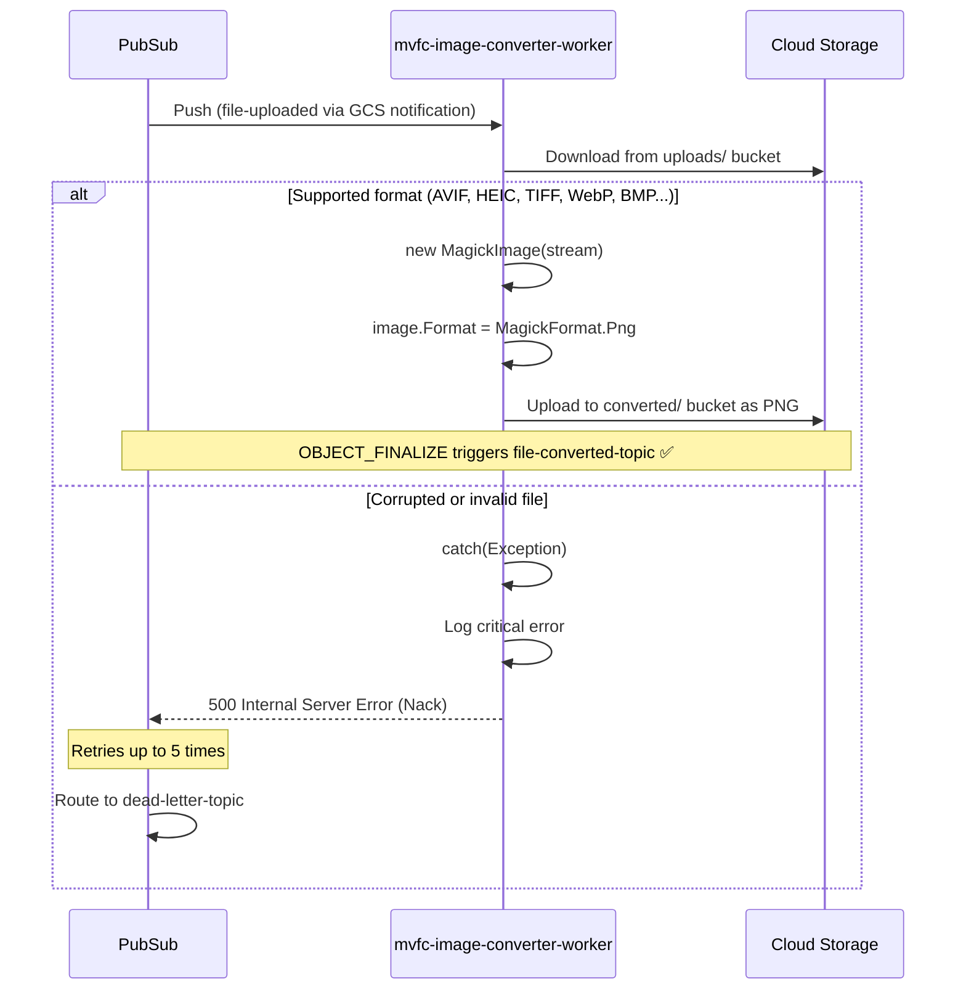
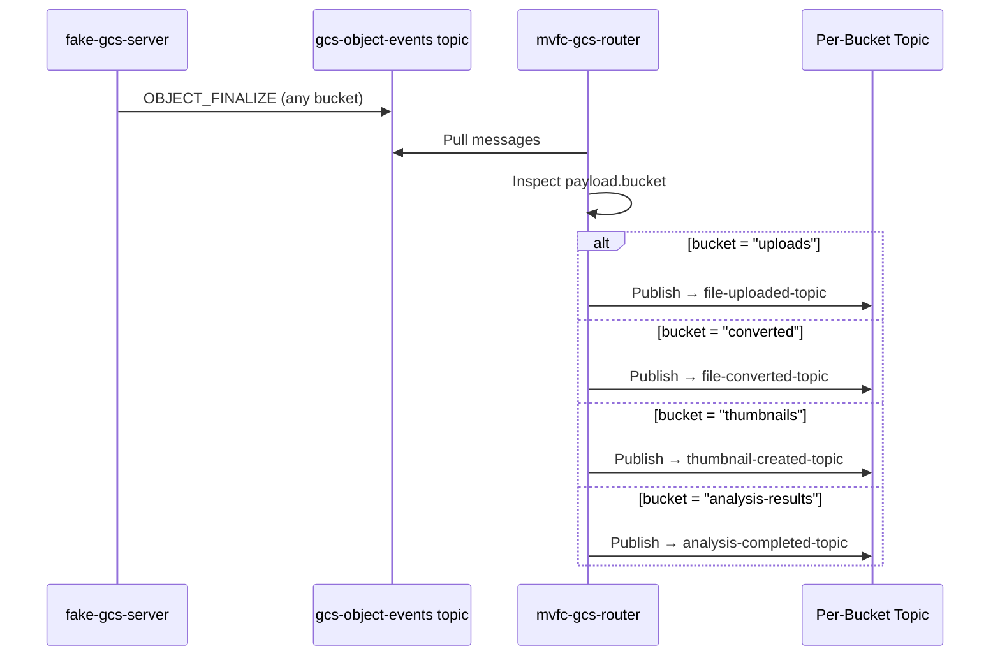
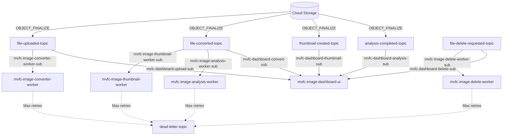

# 📸 MVFC.ImageProcessing — Media Pipeline

[](https://codecov.io/gh/Marcus-V-Freitas/MVFC.ImageProcessing)
[](LICENSE)

> 🇧🇷 [Leia em Português](README.pt-BR.md)

Event-driven image processing pipeline with automatic format normalization, thumbnail generation, AI-powered captioning, and full lifecycle management — 100% local, fully offline.

---

## 🎯 Motivation

Upload any image format supported by Magick.NET (JPEG, PNG, AVIF, HEIC, TIFF, WebP, BMP, and 200+ more) and have it automatically:

1. **Normalized** to a web-safe format (PNG)
2. **Thumbnailed** for quick preview (200×200 PNG)
3. **Described** in natural language by an AI model (BLIP)
4. **Deletable** across all artifacts with a single click

Everything runs **locally** on your machine with no paid cloud services. Google Cloud Pub/Sub and Cloud Storage are emulated via Docker, and infrastructure is provisioned automatically with Terraform.

---

## 📋 Prerequisites

| Tool | Version | Purpose |
|---|---|---|
| [Docker Desktop](https://www.docker.com/products/docker-desktop/) | 24+ | Container runtime |
| [Terraform](https://developer.hashicorp.com/terraform/downloads) | 1.5+ | Infrastructure provisioning |
| [.NET SDK](https://dotnet.microsoft.com/download) | 10.0+ | Build & run C# services (optional for dev) |
| [Git](https://git-scm.com/) | 2.x | Version control |
| `curl` | — | Health checks in start script |

> **Note:** You do **not** need Python, PyTorch, or any ML libraries installed locally. The Vision API runs entirely inside its Docker container.

---

## 🚀 Getting Started

```bash
# Clone the repository
git clone https://github.com/Marcus-V-Freitas/MVFC.ImageProcessing.git
cd MVFC.ImageProcessing

# Start all containers + provision infrastructure
./scripts/start.sh

# Stop everything and clean up
./scripts/stop.sh
```

The `start.sh` script performs the following steps in order:

1. Checks for existing infrastructure (use `./scripts/start.sh --clean` to force a full tear down)
2. Builds and starts or updates all services via `docker compose up -d --build`
3. Waits for PubSub, GCS, and Vision API health checks
4. Runs `terraform init && terraform apply` to ensure topics, subscriptions, and buckets exist

After startup, open the **Dashboard** at [http://localhost:3000](http://localhost:3000).

### Available Endpoints

| Service | URL |
|---|---|
| Dashboard | http://localhost:3000 |
| Upload API | http://localhost:8081/upload |
| Vision API | http://localhost:5000/health |
| GCS Buckets | http://localhost:4443/storage/v1/b |
| PubSub Emulator | http://localhost:8681 |

---

## 🏗️ Architecture Overview

The pipeline follows an **event-driven microservices** architecture using **GCS Object Notifications**. Each processing stage is an independent service. When a worker writes a file to a bucket, Cloud Storage automatically emits an `OBJECT_FINALIZE` notification to a Pub/Sub topic, which triggers the next stage — **workers never publish events explicitly**.

Files are stored in **Google Cloud Storage** (emulated via `fake-gcs-server`) and events flow through **Google Cloud Pub/Sub** (emulated).

> **⚠️ Emulator vs Production:** In production (GCP), Cloud Storage natively sends `OBJECT_FINALIZE` notifications to Pub/Sub topics via [`google_storage_notification`](https://cloud.google.com/storage/docs/pubsub-notifications). The PubSub emulator does **not** support this feature, so a lightweight **GCS Router** sidecar (`scripts/gcs_router.py`) polls a generic `gcs-object-events` topic and routes messages to the correct per-bucket topic. This router exists **only in the local/emulation environment** and is not needed in production.



---

## 📦 Components

| Component | Technology | Port | Responsibility |
|---|---|---|---|
| **mvfc-image-upload-api** | .NET 10 Minimal API | `:8081` | Receives uploads, saves to GCS (triggers pipeline via notification) |
| **mvfc-image-converter-worker** | .NET 10 + Magick.NET | `:8084` | Normalizes any format → PNG, saves to `converted` bucket |
| **mvfc-image-thumbnail-worker** | .NET 10 + Magick.NET | `:8082` | Generates 200×200 PNG thumbnail |
| **mvfc-image-analysis-worker** | .NET 10 + Refit | `:8083` | Sends converted image to AI vision API, saves analysis JSON |
| **mvfc-image-vision-api** | Python 3.12 + Flask + BLIP | `:5000` | Generates natural language description |
| **mvfc-image-delete-worker** | .NET 10 | `:8086` | Deletes image from all 4 buckets |
| **mvfc-image-dashboard-ui** | .NET 10 + HTML/JS | `:3000` | Visual interface with gallery and controls |
| **mvfc-gcs-router** | Python 3.10 (emulator only) | — | Routes GCS notifications to per-bucket Pub/Sub topics |
| **PubSub Emulator** | thekevjames/gcloud-pubsub-emulator | `:8681` | Event bus (emulated) |
| **Cloud Storage** | fake-gcs-server | `:4443` | Object storage (emulated, with notification support) |
| **Terraform** | HCL | — | Provisions topics, subscriptions, buckets, and notifications |

---

## 🔄 Detailed Flows

### 1. Upload & Full Processing

This is the main flow. When a user uploads an image, it passes through **3 processing stages**. Each stage is triggered automatically by a **GCS Object Notification** (`OBJECT_FINALIZE`) — workers never publish events; they simply write files to the appropriate bucket and the notification triggers the next stage.

> **Key change:** After conversion, the **Thumbnail** and **AI Analysis** stages now run **in parallel** (both subscribe to `file-converted-topic`), reducing total processing time.



### 2. Image Deletion

The user can delete any image directly from the interface. Deletion removes **all related artifacts** from all 4 buckets at once.

> **Note:** Deletion is the only flow that still uses explicit Pub/Sub publishing (from the Dashboard), since it is a user-initiated action and not a GCS write event.



### 3. Format Normalization (Detail)

The converter is the **first stage** of the pipeline. It ensures that regardless of the original format (AVIF, HEIC, TIFF, BMP...), all downstream files are treated as PNG. The converted file is saved to a **dedicated `converted` bucket**, preserving the original in `uploads`.



> **Why normalize?** Browsers cannot natively display formats like TIFF, HEIC, or BMP. By converting everything to PNG at the beginning of the pipeline, we ensure the image displayed in the Dashboard **always works** — no broken image icons.

### 4. GCS Router (Emulator Only)

In production GCP, `google_storage_notification` resources automatically send `OBJECT_FINALIZE` events from buckets to Pub/Sub topics. The `fake-gcs-server` emulator supports sending events to a **single generic topic** (`gcs-object-events`), but cannot route to different topics per bucket.

The **GCS Router** (`scripts/gcs_router.py`) bridges this gap:



> **This component does not exist in production.** In GCP, each `google_storage_notification` resource sends events directly to the correct topic. The Terraform configuration includes these resources but skips them locally via `count = var.is_local ? 0 : 1`.

---

## 🧩 Event Topology (Pub/Sub)

Each arrow represents a Pub/Sub topic with its respective push subscription. **Events are produced by GCS Object Notifications** (not by workers), except for the delete flow which is user-initiated.



| Topic | Trigger | Consumer | Ack Deadline |
|---|---|---|---|
| `file-uploaded-topic` | GCS notification (`uploads` bucket) | mvfc-image-converter-worker, mvfc-image-dashboard-ui | 60s |
| `file-converted-topic` | GCS notification (`converted` bucket) | mvfc-image-thumbnail-worker, mvfc-image-analysis-worker, mvfc-image-dashboard-ui | 600s |
| `thumbnail-created-topic` | GCS notification (`thumbnails` bucket) | mvfc-image-dashboard-ui | 600s |
| `analysis-completed-topic` | GCS notification (`analysis-results` bucket) | mvfc-image-dashboard-ui | 10s |
| `file-delete-requested-topic` | mvfc-image-dashboard-ui (explicit publish) | mvfc-image-delete-worker, mvfc-image-dashboard-ui | 30s |
| `gcs-object-events` | fake-gcs-server (emulator only) | mvfc-gcs-router | — |

---

## 🗄️ Buckets (Cloud Storage)

| Bucket | Contents | Written by | Read by | GCS Notification → Topic |
|---|---|---|---|---|
| `uploads` | Original image (any format) | mvfc-image-upload-api | mvfc-image-converter-worker | `file-uploaded-topic` |
| `converted` | Normalized PNG image | mvfc-image-converter-worker | mvfc-image-thumbnail-worker, mvfc-image-analysis-worker, mvfc-image-dashboard-ui | `file-converted-topic` |
| `thumbnails` | 200×200 PNG thumbnails | mvfc-image-thumbnail-worker | mvfc-image-dashboard-ui | `thumbnail-created-topic` |
| `analysis-results` | JSON with AI-generated description and dominant colors | mvfc-image-analysis-worker | mvfc-image-dashboard-ui | `analysis-completed-topic` |

---

## 🛠️ Technology & Design Decisions

### Why Magick.NET?

The image processing library is essential for two workers: the converter (normalization) and the thumbnail generator.

| Criterion | ~~SixLabors.ImageSharp~~ | **Magick.NET** ✅ |
|---|---|---|
| **License** | Paid (v4+) or vulnerable (v3.x) | Apache 2.0 (free) |
| **AVIF** | ❌ Not supported | ✅ Native |
| **HEIC/HEIF** | ❌ | ✅ |
| **Total formats** | ~12 | **200+** |
| **Native deps in Docker** | None | Bundled in NuGet |

**Package used:** `Magick.NET-Q8-AnyCPU` v14.13.1 (Q8 = 8 bits per channel — sufficient for web and lighter on memory).

### Why BLIP (Salesforce)?

For generating natural language image descriptions, we use the **BLIP** (Bootstrapping Language-Image Pre-training) model.

| Criterion | Decision |
|---|---|
| **Model** | `Salesforce/blip-image-captioning-base` |
| **Runtime** | PyTorch CPU-only |
| **Latency** | ~3-5 seconds per image |
| **Quality** | Natural and readable descriptions |
| **Offline** | ✅ Model pre-downloaded during Docker build |

Discarded alternatives:
- **YOLOv8** — Returned generic and imprecise tags ("person", "dining table")
- **Ollama (LLaVA)** — Too slow on CPU (~30s), too heavy for local use

### Why Refit for the Vision API Client?

The `mvfc-image-analysis-worker` uses [Refit](https://github.com/reactiveui/refit) to call the Python Vision API. This provides a type-safe, declarative HTTP client via an interface (`IVisionApiClient`), replacing raw `HttpClient` calls and making the service easier to test and maintain.

### Why GCS Object Notifications?

Instead of having each worker explicitly publish to the next Pub/Sub topic, we leverage **GCS Object Notifications** (`OBJECT_FINALIZE`). This means:

- **Zero coupling between stages**: Workers only need to know *which bucket to write to*. They don't need Pub/Sub clients, topic names, or publishing logic.
- **Simpler handlers**: Domain handlers no longer depend on `IPublishService` — they just store files and return.
- **Automatic event emission**: Writing a file to a bucket is enough to trigger the next stage. The GCS → Pub/Sub integration is managed at the infrastructure level (Terraform).
- **Push subscriptions**: Each worker is a Minimal API exposing a `/pubsub/push` endpoint. Pub/Sub delivers messages automatically.
- **Automatic retry**: If a worker is unavailable, Pub/Sub redelivers the message after `ack_deadline_seconds`.

> **Emulator note:** Since `fake-gcs-server` cannot route to per-bucket topics, the `mvfc-gcs-router` sidecar handles this routing locally. In production, `google_storage_notification` Terraform resources handle it natively.

### Why Local Emulators?

| Service | Emulator | Reason |
|---|---|---|
| Pub/Sub | `gcloud beta emulators pubsub` | Zero cost, works offline |
| Cloud Storage | `fake-gcs-server` | API compatible with real GCS |
| Terraform | Google Provider | Provisions against the emulators |

**Advantage**: The worker code is **identical** to what would run on real GCP. The only difference is the `*_EMULATOR_HOST` environment variable.

---

## 🧪 Testing

The project includes a test project ready for unit and integration tests:

```bash
dotnet test
```

You can also use the HTTP file at `scripts/mvfc.image-processing.http` for manual API testing (compatible with VS Code REST Client / JetBrains HTTP Client).

---

## 📁 Project Structure

```
MVFC.ImageProcessing/
├── src/
│   ├── MVFC.Image.Domain/                 # Core business logic, Contracts and CQRS Handlers
│   ├── MVFC.Image.Infra/                  # GCP Implementations (Storage and Pub/Sub)
│   ├── MVFC.Image.IoC/                    # Dependency Injection and Configuration
│   ├── MVFC.Image.Shareable/              # Shared events, DTOs and GCS notification mapper
│   ├── MVFC.ImageUpload.Api/              # Receives uploads via HTTP
│   ├── MVFC.ImageConverter.Worker/        # Normalizes any format → PNG (saves to converted bucket)
│   ├── MVFC.ImageThumbnail.Worker/        # Generates 200×200 thumbnails
│   ├── MVFC.ImageAnalysis.Worker/         # Orchestrates AI analysis (Refit + Polly)
│   ├── MVFC.ImageVision.Api/              # BLIP model (Python/Flask)
│   ├── MVFC.ImageDelete.Worker/           # Deletes files from 4 buckets
│   └── MVFC.ImageDashboard.UI/            # Web interface (HTML/JS)
├── tests/
│   ├── MVFC.Image.Domain.Tests/           # Unit tests for Domain layer
│   ├── MVFC.Image.Infra.Tests/            # Unit tests for Infra layer
│   ├── MVFC.Image.Shareable.Tests/        # Unit tests for Shareable layer (incl. GcsNotificationMapper)
│   ├── MVFC.ImageUpload.Api.Tests/        # Integration tests for Upload API
│   ├── MVFC.ImageConverter.Worker.Tests/  # Integration tests for Converter Worker
│   ├── MVFC.ImageThumbnail.Worker.Tests/  # Integration tests for Thumbnail Worker
│   ├── MVFC.ImageAnalysis.Worker.Tests/   # Integration tests for Analysis Worker
│   ├── MVFC.ImageDelete.Worker.Tests/     # Integration tests for Delete Worker
│   └── MVFC.ImageDashboard.UI.Tests/      # Integration tests for Dashboard UI
├── scripts/
│   ├── start.sh                           # Start all infrastructure
│   ├── stop.sh                            # Tear down everything
│   ├── gcs_router.py                      # GCS notification router (emulator only)
│   └── mvfc.image-processing.http         # HTTP request samples
├── terraform/                             # IaC: topics, subs, buckets, notifications
├── samples/                               # Sample images for testing
├── docker-compose.yml                     # Container orchestration
├── MVFC.ImageProcessing.slnx              # Solution file
├── Directory.Build.props                  # Shared MSBuild properties
├── Directory.Build.targets                # Shared MSBuild targets (analyzers)
├── Directory.Packages.props               # Central package management
├── CONTRIBUTING.md                        # Contribution guidelines
├── SECURITY.md                            # Security policy
├── LICENSE                                # Apache 2.0
├── README.md                              # ← You are here! (English)
└── README.pt-BR.md                        # Portuguese version
```

---

## ⚙️ Advanced Architecture Patterns

This project implements enterprise-grade distributed system patterns:
- **GCS Object Notifications:** Workers don't publish events — they write files to buckets, and GCS automatically emits `OBJECT_FINALIZE` notifications to the corresponding Pub/Sub topic. This eliminates `IPublishService` from all handlers (except the Dashboard's delete flow) and reduces coupling.
- **GCS Notification Router (Emulator):** Since the `fake-gcs-server` emulator can only publish to a single generic topic, a lightweight Python sidecar (`scripts/gcs_router.py`) polls `gcs-object-events` and re-publishes to the correct per-bucket topic. This component is conditionally deployed and has no equivalent in production.
- **Dead-Letter Queues (DLQ):** Configured via Terraform. If a worker fails to process a poison message (e.g., an invalid file) 5 times, it is safely routed to the `dead-letter-topic` instead of causing infinite retries.
- **Circuit Breakers & Retries:** The HTTP calls to the Vision API are wrapped with `Microsoft.Extensions.Http.Resilience`, providing automatic retries, timeouts, and circuit breakers against transient AI model failures.
- **Parallel Processing:** After conversion, Thumbnail and Analysis workers both subscribe to `file-converted-topic` and run concurrently, reducing total pipeline latency.

---

## 🔒 Privacy & Security

A core principle of this project is **Data Privacy**. Because the entire pipeline (including the AI vision model) runs locally via Docker:
- Your images **never** leave your machine.
- No third-party API keys are required.
- No cloud storage costs or data mining.
- Suitable for processing sensitive, personal, or confidential media.

---

## 🚑 Troubleshooting

- **Ports already in use:** If ports like `:3000`, `:5000`, or `:8081` are occupied, the containers won't start. Stop conflicting services or map different ports in `docker-compose.yml`.
- **First run is slow:** The first time you run `./scripts/start.sh`, Docker will download the Salesforce BLIP model (~1.5GB). Subsequent starts will be immediate.
- **Images not appearing in Dashboard:** Check if the Pub/Sub emulator and Terraform provisioning completed successfully. You can view worker logs via `docker compose logs -f`.
- **Thumbnails not loading:** The thumbnail filename always uses `.png` extension regardless of the original file format (e.g., `thumb-{guid}-photo.png`). Verify this matches what the dashboard requests.
- **Upload rejected with 400:** The upload validator accepts any `image/*` content type. Ensure your file is a valid image and its filename does not contain OS-reserved characters (`\`, `/`, `:`, `*`, `?`, `"`, `<`, `>`, `|`).

---

## Contributing

See [CONTRIBUTING.md](CONTRIBUTING.md).

---

## 📄 License

This project is licensed under the [Apache License 2.0](LICENSE).
