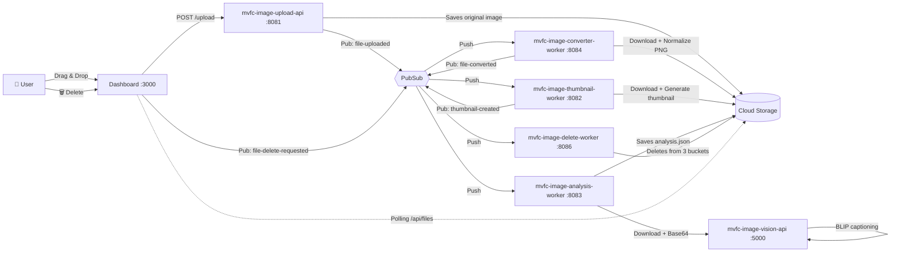
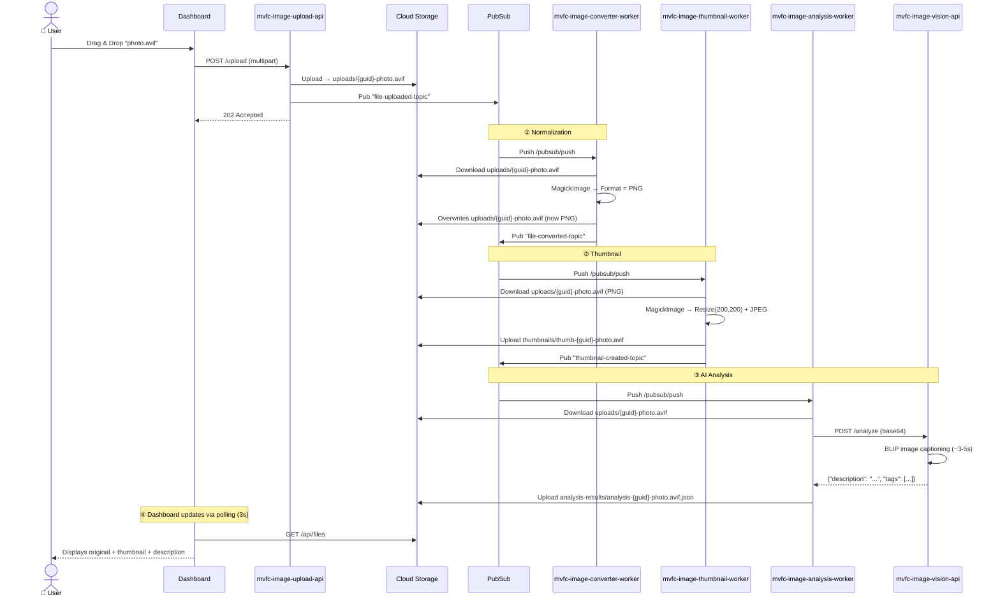
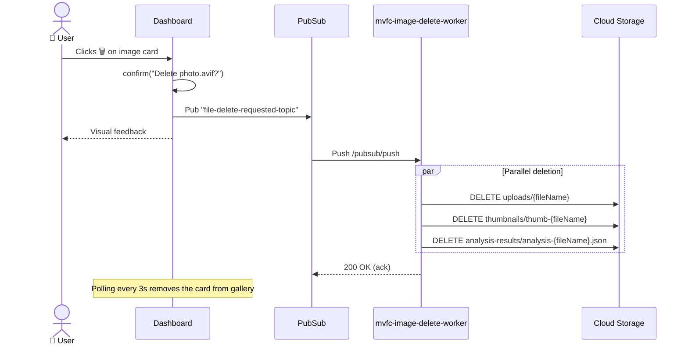
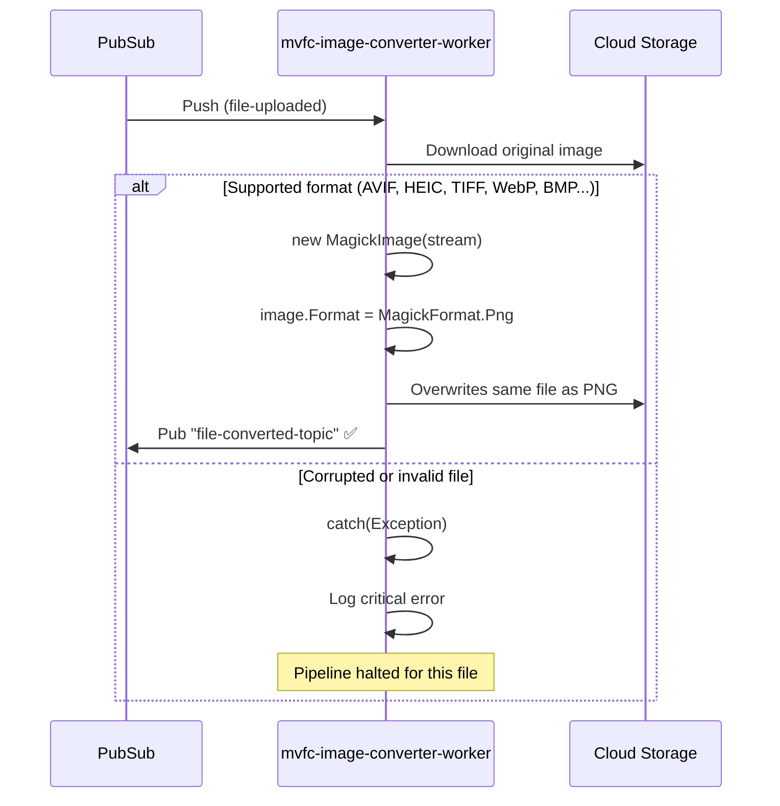
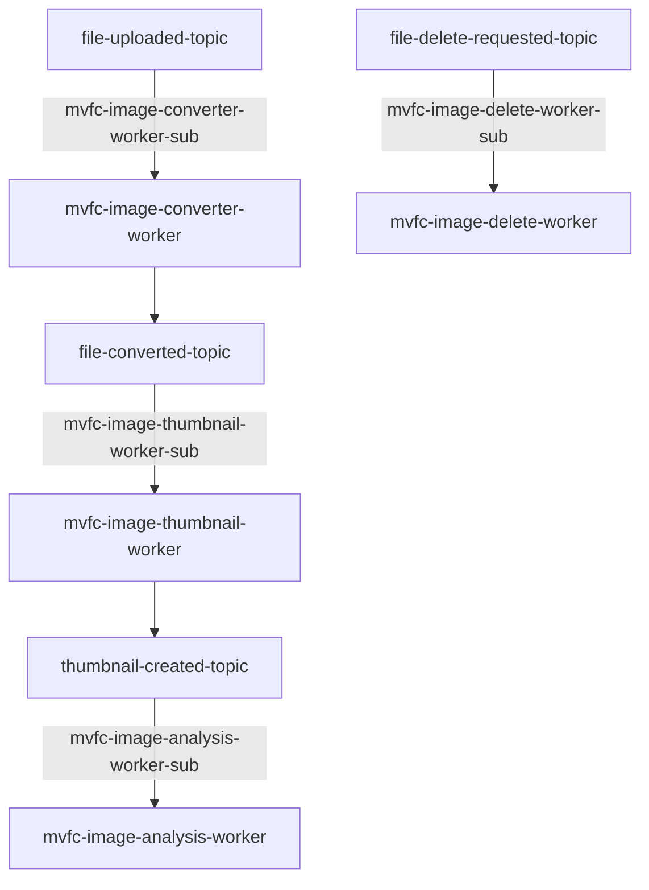

# 📸 MVFC.ImageProcessing — Media Pipeline

> 🇧🇷 [Leia em Português](README.pt-BR.md)

Event-driven image processing pipeline with automatic format normalization, thumbnail generation, AI-powered captioning, and full lifecycle management — 100% local, fully offline.

---

## 🎯 Motivation

Upload any image — JPEG, PNG, AVIF, HEIC, TIFF, WebP — and have it automatically:

1. **Normalized** to a web-safe format (PNG)
2. **Thumbnailed** for quick preview (200×200 JPEG)
3. **Described** in natural language by an AI model (BLIP)
4. **Deletable** across all artifacts with a single click

Everything runs **locally** on your machine with no paid cloud services. Google Cloud Pub/Sub and Cloud Storage are emulated via Docker, and infrastructure is provisioned automatically with Terraform.

---

## 📋 Prerequisites

| Tool | Version | Purpose |
|---|---|---|
| [Docker Desktop](https://www.docker.com/products/docker-desktop/) | 24+ | Container runtime |
| [Terraform](https://developer.hashicorp.com/terraform/downloads) | 1.5+ | Infrastructure provisioning |
| [.NET SDK](https://dotnet.microsoft.com/download) | 10.0+ | Build & run C# services (optional for dev) |
| [Git](https://git-scm.com/) | 2.x | Version control |
| `curl` | — | Health checks in start script |

> **Note:** You do **not** need Python, PyTorch, or any ML libraries installed locally. The Vision API runs entirely inside its Docker container.

---

## 🚀 Getting Started

```bash
# Clone the repository
git clone https://github.com/Marcus-V-Freitas/MVFC.ImageProcessing.git
cd MVFC.ImageProcessing

# Start all containers + provision infrastructure
./scripts/start.sh

# Stop everything and clean up
./scripts/stop.sh
```

The `start.sh` script performs the following steps in order:

1. Checks for existing infrastructure (use `./scripts/start.sh --clean` to force a full tear down)
2. Builds and starts or updates all services via `docker compose up -d --build`
3. Waits for PubSub, GCS, and Vision API health checks
4. Runs `terraform init && terraform apply` to ensure topics, subscriptions, and buckets exist

After startup, open the **Dashboard** at [http://localhost:3000](http://localhost:3000).

### Available Endpoints

| Service | URL |
|---|---|
| Dashboard | http://localhost:3000 |
| Upload API | http://localhost:8081/upload |
| Vision API | http://localhost:5000/health |
| GCS Buckets | http://localhost:4443/storage/v1/b |
| PubSub Emulator | http://localhost:8085 |

---

## 🏗️ Architecture Overview

The pipeline follows an **event-driven microservices** architecture. Each processing stage is an independent service communicating exclusively via **Google Cloud Pub/Sub** (emulated). Files are stored in **Google Cloud Storage** (emulated via `fake-gcs-server`).



---

## 📦 Components

| Component | Technology | Port | Responsibility |
|---|---|---|---|
| **mvfc-image-upload-api** | .NET 10 Minimal API | `:8081` | Receives uploads, saves to GCS, emits event |
| **mvfc-image-converter-worker** | .NET 10 + Magick.NET | `:8084` | Normalizes any format → PNG |
| **mvfc-image-thumbnail-worker** | .NET 10 + Magick.NET | `:8082` | Generates 200×200 JPEG thumbnail |
| **mvfc-image-analysis-worker** | .NET 10 + Refit | `:8083` | Sends image to AI vision API |
| **mvfc-image-vision-api** | Python 3.12 + Flask + BLIP | `:5000` | Generates natural language description |
| **mvfc-image-delete-worker** | .NET 10 | `:8086` | Deletes image from all 3 buckets |
| **mvfc-image-dashboard-ui** | .NET 10 + HTML/JS | `:3000` | Visual interface with gallery and controls |
| **PubSub Emulator** | Google Cloud CLI | `:8085` | Event bus (emulated) |
| **Cloud Storage** | fake-gcs-server | `:4443` | Object storage (emulated) |
| **Terraform** | HCL | — | Provisions topics, subscriptions, and buckets |

---

## 🔄 Detailed Flows

### 1. Upload & Full Processing

This is the main flow. When a user uploads an image, it passes through **4 sequential stages**, each triggered by a Pub/Sub event.



### 2. Image Deletion

The user can delete any image directly from the interface. Deletion removes **all related artifacts** from all 3 buckets at once.



### 3. Format Normalization (Detail)

The converter is the **first stage** of the pipeline. It ensures that regardless of the original format (AVIF, HEIC, TIFF, BMP...), all downstream files are treated as PNG.



> **Why normalize?** Browsers cannot natively display formats like TIFF, HEIC, or BMP. By converting everything to PNG at the beginning of the pipeline, we ensure the original image displayed in the Dashboard **always works** — no broken image icons.

---

## 🧩 Event Topology (Pub/Sub)

Each arrow represents a Pub/Sub topic with its respective push subscription.



| Topic | Producer | Consumer | Ack Deadline |
|---|---|---|---|
| `file-uploaded-topic` | mvfc-image-upload-api | mvfc-image-converter-worker | 60s |
| `file-converted-topic` | mvfc-image-converter-worker | mvfc-image-thumbnail-worker | 600s |
| `thumbnail-created-topic` | mvfc-image-thumbnail-worker | mvfc-image-analysis-worker | 600s |
| `file-delete-requested-topic` | mvfc-image-dashboard-ui | mvfc-image-delete-worker | 30s |

---

## 🗄️ Buckets (Cloud Storage)

| Bucket | Contents | Written by | Read by |
|---|---|---|---|
| `uploads` | Original image (normalized to PNG) | mvfc-image-upload-api, mvfc-image-converter-worker | mvfc-image-thumbnail-worker, mvfc-image-analysis-worker, mvfc-image-dashboard-ui |
| `thumbnails` | 200×200 JPEG thumbnails | mvfc-image-thumbnail-worker | mvfc-image-dashboard-ui |
| `analysis-results` | JSON with AI-generated description | mvfc-image-analysis-worker | mvfc-image-dashboard-ui |

---

## 🛠️ Technology & Design Decisions

### Why Magick.NET?

The image processing library is essential for two workers: the converter (normalization) and the thumbnail generator.

| Criterion | ~~SixLabors.ImageSharp~~ | **Magick.NET** ✅ |
|---|---|---|
| **License** | Paid (v4+) or vulnerable (v3.x) | Apache 2.0 (free) |
| **AVIF** | ❌ Not supported | ✅ Native |
| **HEIC/HEIF** | ❌ | ✅ |
| **Total formats** | ~12 | **200+** |
| **Native deps in Docker** | None | Bundled in NuGet |

**Package used:** `Magick.NET-Q8-AnyCPU` v14.13.1 (Q8 = 8 bits per channel — sufficient for web and lighter on memory).

### Why BLIP (Salesforce)?

For generating natural language image descriptions, we use the **BLIP** (Bootstrapping Language-Image Pre-training) model.

| Criterion | Decision |
|---|---|
| **Model** | `Salesforce/blip-image-captioning-base` |
| **Runtime** | PyTorch CPU-only |
| **Latency** | ~3-5 seconds per image |
| **Quality** | Natural and readable descriptions |
| **Offline** | ✅ Model pre-downloaded during Docker build |

Discarded alternatives:
- **YOLOv8** — Returned generic and imprecise tags ("person", "dining table")
- **Ollama (LLaVA)** — Too slow on CPU (~30s), too heavy for local use

### Why Refit for the Vision API Client?

The `mvfc-image-analysis-worker` uses [Refit](https://github.com/reactiveui/refit) to call the Python Vision API. This provides a type-safe, declarative HTTP client via an interface (`IVisionApiClient`), replacing raw `HttpClient` calls and making the service easier to test and maintain.

### Why Pub/Sub + Push?

- **Total decoupling**: Each worker is independent and can scale or fail without affecting the others.
- **Push vs Pull**: We use push subscriptions for simplicity — each worker is a Minimal API that exposes a `/pubsub/push` endpoint. The emulator handles delivery automatically.
- **Automatic retry**: If a worker is unavailable, Pub/Sub redelivers the message after the `ack_deadline_seconds`.

### Why Local Emulators?

| Service | Emulator | Reason |
|---|---|---|
| Pub/Sub | `gcloud beta emulators pubsub` | Zero cost, works offline |
| Cloud Storage | `fake-gcs-server` | API compatible with real GCS |
| Terraform | Google Provider | Provisions against the emulators |

**Advantage**: The worker code is **identical** to what would run on real GCP. The only difference is the `*_EMULATOR_HOST` environment variable.

---

## 🧪 Testing

The project includes a test project ready for unit and integration tests:

```bash
dotnet test tests/MVFC.ImageProcessing.Tests/MVFC.ImageProcessing.Tests.csproj
```

You can also use the HTTP file at `scripts/mvfc.image-processing.http` for manual API testing (compatible with VS Code REST Client / JetBrains HTTP Client).

---

## 📁 Project Structure

```
MVFC.ImageProcessing/
├── src/
│   ├── MVFC.Image.Domain/                 # Core business logic, Contracts and CQRS Handlers
│   ├── MVFC.Image.Infra/                  # GCP Implementations (Storage and Pub/Sub)
│   ├── MVFC.Image.IoC/                    # Dependency Injection and Configuration
│   ├── MVFC.Image.Shareable/              # Shared events and DTOs
│   ├── MVFC.ImageUpload.Api/              # Receives uploads via HTTP
│   ├── MVFC.ImageConverter.Worker/        # Normalizes any format → PNG
│   ├── MVFC.ImageThumbnail.Worker/        # Generates 200×200 thumbnails
│   ├── MVFC.ImageAnalysis.Worker/         # Orchestrates AI analysis (Refit)
│   ├── MVFC.ImageVision.Api/              # BLIP model (Python/Flask)
│   ├── MVFC.ImageDelete.Worker/           # Deletes files from 3 buckets
│   └── MVFC.ImageDashboard.UI/            # Web interface (HTML/JS)
├── tests/
│   └── MVFC.ImageProcessing.Tests/        # Unit & integration tests
├── scripts/
│   ├── start.sh                           # Start all infrastructure
│   ├── stop.sh                            # Tear down everything
│   └── mvfc.image-processing.http         # HTTP request samples
├── terraform/                             # IaC: topics, subs, buckets
├── samples/                               # Sample images for testing
├── docker-compose.yml                     # Container orchestration
├── MVFC.ImageProcessing.slnx              # Solution file
├── Directory.Build.props                  # Shared MSBuild properties
├── Directory.Build.targets                # Shared MSBuild targets (analyzers)
├── Directory.Packages.props               # Central package management
├── CONTRIBUTING.md                        # Contribution guidelines
├── SECURITY.md                            # Security policy
├── LICENSE                                # Apache 2.0
├── README.md                              # ← You are here! (English)
└── README.pt-BR.md                        # Portuguese version
```

---

## Contributing

See [CONTRIBUTING.md](CONTRIBUTING.md).

---

## 📄 License

This project is licensed under the [Apache License 2.0](LICENSE).
