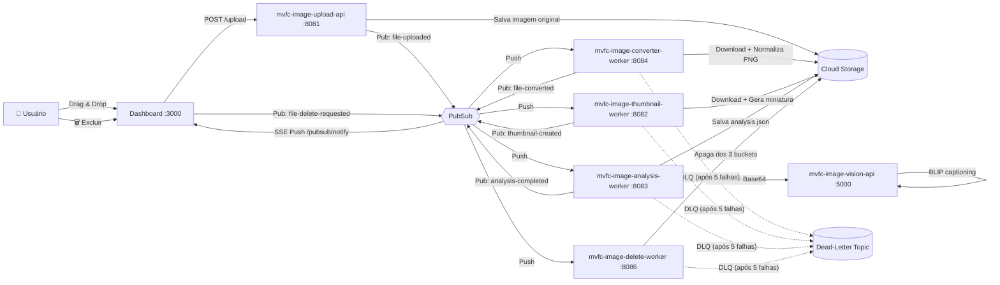
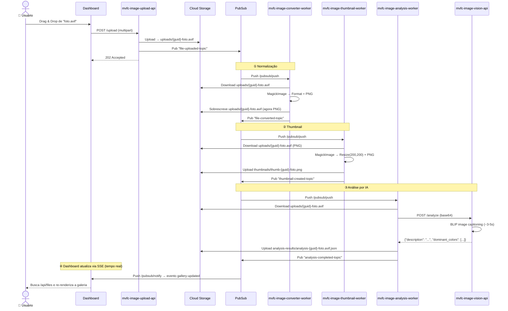
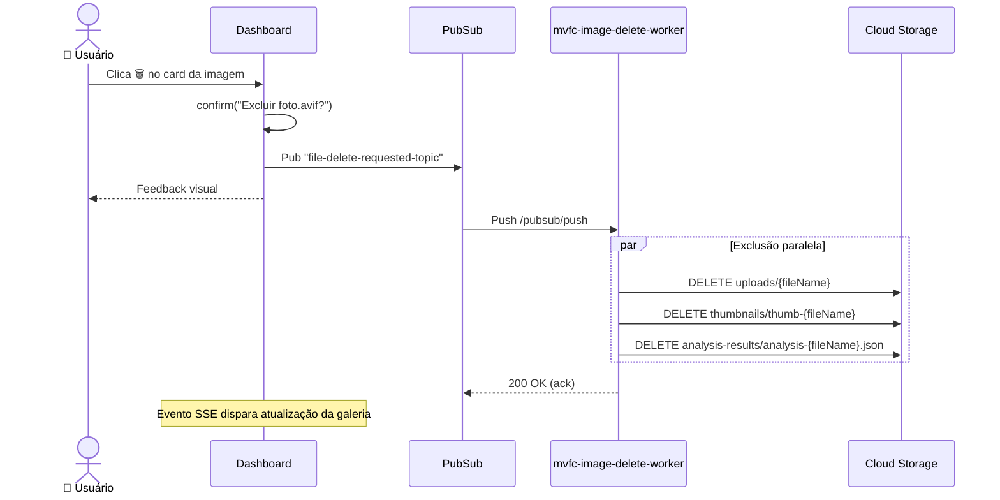
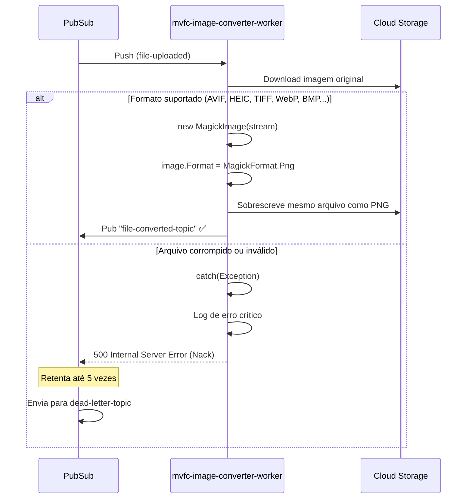
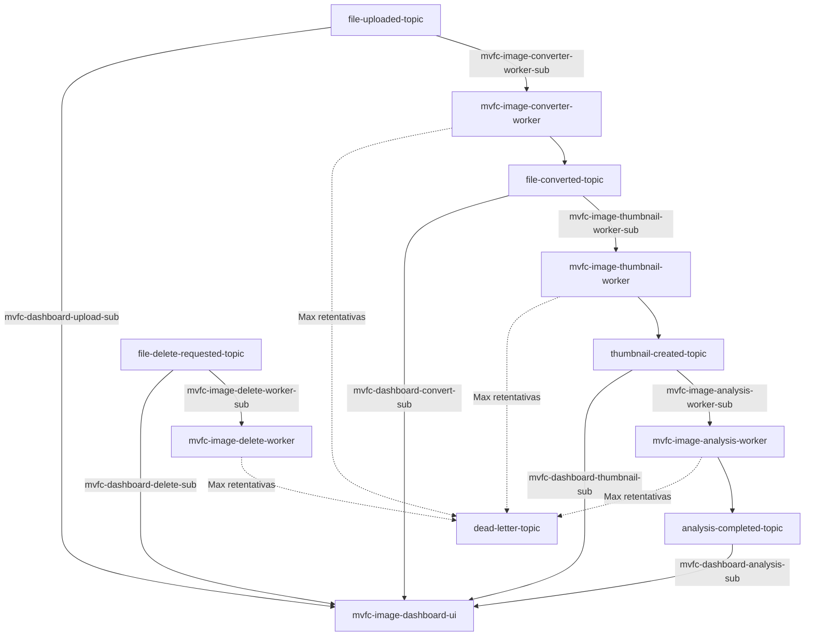

# 📸 MVFC.ImageProcessing — Media Pipeline

[](https://codecov.io/gh/Marcus-V-Freitas/MVFC.ImageProcessing)
[](LICENSE)

> 🇺🇸 [Read in English](README.md)

Pipeline event-driven de processamento de imagens com normalização automática de formato, geração de thumbnails, captioning por IA e gerenciamento completo do ciclo de vida — 100% local, totalmente offline.

---

## 🎯 Motivação

Faça upload de qualquer imagem nos formatos suportados pelo Magick.NET (JPEG, PNG, AVIF, HEIC, TIFF, WebP, BMP e mais de 200 outros) e tenha automaticamente:

1. O arquivo **normalizado** para um formato web-safe (PNG)
2. Uma **miniatura** gerada para visualização rápida (200×200 PNG)
3. Uma **descrição em linguagem natural** gerada por IA (BLIP)
4. A possibilidade de **excluir** todos os artefatos com um clique

Tudo roda **localmente** na sua máquina, sem depender de nenhum serviço em nuvem pago. Os serviços do Google Cloud (Pub/Sub e Cloud Storage) são emulados via Docker, e a infraestrutura é provisionada automaticamente via Terraform.

---

## 📋 Pré-requisitos

| Ferramenta | Versão | Propósito |
|---|---|---|
| [Docker Desktop](https://www.docker.com/products/docker-desktop/) | 24+ | Runtime de containers |
| [Terraform](https://developer.hashicorp.com/terraform/downloads) | 1.5+ | Provisionamento de infraestrutura |
| [.NET SDK](https://dotnet.microsoft.com/download) | 10.0+ | Build e execução dos serviços C# (opcional para dev) |
| [Git](https://git-scm.com/) | 2.x | Controle de versão |
| `curl` | — | Health checks no script de start |

> **Nota:** Você **não** precisa ter Python, PyTorch ou qualquer biblioteca de ML instalada localmente. A Vision API roda inteiramente dentro do seu container Docker.

---

## 🚀 Como Rodar

```bash
# Clone o repositório
git clone https://github.com/Marcus-V-Freitas/MVFC.ImageProcessing.git
cd MVFC.ImageProcessing

# Subir todos os containers + provisionar infraestrutura
./scripts/start.sh

# Parar tudo e limpar
./scripts/stop.sh
```

O script `start.sh` executa os seguintes passos na ordem:

1. Verifica a infraestrutura existente (use `./scripts/start.sh --clean` para recriar do zero)
2. Builda e atualiza apenas os serviços modificados via `docker compose up -d --build`
3. Aguarda os health checks do PubSub, GCS e Vision API
4. Executa `terraform init && terraform apply` para garantir os tópicos, subscriptions e buckets

Após subir, acesse o **Dashboard** em [http://localhost:3000](http://localhost:3000).

### Endpoints Disponíveis

| Serviço | URL |
|---|---|
| Dashboard | http://localhost:3000 |
| Upload API | http://localhost:8081/upload |
| Vision API | http://localhost:5000/health |
| GCS Buckets | http://localhost:4443/storage/v1/b |
| PubSub Emulator | http://localhost:8681 |

---

## 🏗️ Visão Geral da Arquitetura

O pipeline segue uma arquitetura **event-driven com microserviços**. Cada etapa do processamento é um serviço independente que se comunica exclusivamente via **Google Cloud Pub/Sub** (emulado). Os arquivos são armazenados no **Google Cloud Storage** (emulado via `fake-gcs-server`).



---

## 📦 Componentes

| Componente | Tecnologia | Porta | Responsabilidade |
|---|---|---|---|
| **mvfc-image-upload-api** | .NET 10 Minimal API | `:8081` | Recebe uploads, salva no GCS, emite evento |
| **mvfc-image-converter-worker** | .NET 10 + Magick.NET | `:8084` | Normaliza qualquer formato → PNG |
| **mvfc-image-thumbnail-worker** | .NET 10 + Magick.NET | `:8082` | Gera miniatura 200×200 em PNG |
| **mvfc-image-analysis-worker** | .NET 10 + Refit | `:8083` | Envia imagem para API de visão IA e publica evento `analysis-completed` |
| **mvfc-image-vision-api** | Python 3.12 + Flask + BLIP | `:5000` | Gera descrição em linguagem natural |
| **mvfc-image-delete-worker** | .NET 10 | `:8086` | Exclui imagem dos 3 buckets |
| **mvfc-image-dashboard-ui** | .NET 10 + HTML/JS | `:3000` | Interface visual com galeria e controles |
| **PubSub Emulator** | thekevjames/gcloud-pubsub-emulator | `:8681` | Barramento de eventos (emulado) |
| **Cloud Storage** | fake-gcs-server | `:4443` | Armazenamento de objetos (emulado) |
| **Terraform** | HCL | — | Provisiona tópicos, subscriptions e buckets |

---

## 🔄 Fluxos Detalhados

### 1. Upload & Processamento Completo

Este é o fluxo principal. Quando o usuário faz upload de uma imagem, ela passa por **4 estágios sequenciais**, cada um ativado por um evento Pub/Sub.



### 2. Exclusão de Imagem

O usuário pode excluir qualquer imagem diretamente pela interface. A exclusão apaga **todos os artefatos relacionados** dos 3 buckets de uma vez.



### 3. Normalização de Formato (Detalhe)

O converter é o **primeiro estágio** do pipeline. Ele garante que, independentemente do formato original (AVIF, HEIC, TIFF, BMP...), todos os arquivos downstream sejam tratados como PNG.



> **Por que normalizar?** Navegadores não conseguem exibir formatos como TIFF, HEIC ou BMP nativamente. Ao converter tudo para PNG no início do pipeline, garantimos que a imagem original exibida no Dashboard **sempre funcione** — sem ícones de imagem quebrada.

---

## 🧩 Topologia de Eventos (Pub/Sub)

Cada seta representa um tópico Pub/Sub com sua respectiva subscription push.



| Tópico | Produtor | Consumidor | Ack Deadline |
|---|---|---|---|
| `file-uploaded-topic` | mvfc-image-upload-api | mvfc-image-converter-worker, mvfc-image-dashboard-ui | 60s |
| `file-converted-topic` | mvfc-image-converter-worker | mvfc-image-thumbnail-worker, mvfc-image-dashboard-ui | 600s |
| `thumbnail-created-topic` | mvfc-image-thumbnail-worker | mvfc-image-analysis-worker, mvfc-image-dashboard-ui | 600s |
| `file-delete-requested-topic` | mvfc-image-dashboard-ui | mvfc-image-delete-worker, mvfc-image-dashboard-ui | 30s |
| `analysis-completed-topic` | mvfc-image-analysis-worker | mvfc-image-dashboard-ui | 10s |

---

## 🗄️ Buckets (Cloud Storage)

| Bucket | Conteúdo | Escrito por | Lido por |
|---|---|---|---|
| `uploads` | Imagem original (normalizada para PNG) | mvfc-image-upload-api, mvfc-image-converter-worker | mvfc-image-thumbnail-worker, mvfc-image-analysis-worker, mvfc-image-dashboard-ui |
| `thumbnails` | Miniaturas 200×200 em PNG | mvfc-image-thumbnail-worker | mvfc-image-dashboard-ui |
| `analysis-results` | JSON com descrição gerada por IA e cores dominantes | mvfc-image-analysis-worker | mvfc-image-dashboard-ui |

---

## 🛠️ Tecnologias & Decisões

### Por que Magick.NET?

A biblioteca de processamento de imagens é essencial para dois workers: o converter (normalização) e o gerador de thumbnails.

| Critério | ~~SixLabors.ImageSharp~~ | **Magick.NET** ✅ |
|---|---|---|
| **Licença** | Paga (v4+) ou vulnerável (v3.x) | Apache 2.0 (gratuita) |
| **AVIF** | ❌ Não suporta | ✅ Nativo |
| **HEIC/HEIF** | ❌ | ✅ |
| **Formatos totais** | ~12 | **200+** |
| **Deps nativas no Docker** | Nenhuma | Embutidas no NuGet |

**Pacote usado:** `Magick.NET-Q8-AnyCPU` v14.13.1 (Q8 = 8 bits por canal — suficiente para web e mais leve em memória).

### Por que BLIP (Salesforce)?

Para gerar descrições das imagens em linguagem natural, usamos o modelo **BLIP** (Bootstrapping Language-Image Pre-training).

| Critério | Decisão |
|---|---|
| **Modelo** | `Salesforce/blip-image-captioning-base` |
| **Runtime** | PyTorch CPU-only |
| **Latência** | ~3-5 segundos por imagem |
| **Qualidade** | Descrições naturais e legíveis |
| **Offline** | ✅ Modelo pré-baixado durante o Docker build |

Alternativas descartadas:
- **YOLOv8** — Retornava tags genéricas e imprecisas ("person", "dining table")
- **Ollama (LLaVA)** — Muito lento em CPU (~30s), pesado para uso local

### Por que Refit para o Cliente da Vision API?

O `mvfc-image-analysis-worker` usa [Refit](https://github.com/reactiveui/refit) para chamar a Vision API em Python. Isso fornece um cliente HTTP tipado e declarativo via interface (`IVisionApiClient`), substituindo chamadas brutas de `HttpClient` e tornando o serviço mais fácil de testar e manter.

### Por que Pub/Sub + Push?

- **Desacoplamento total**: Cada worker é independente, pode escalar ou falhar sem afetar os demais.
- **Push vs Pull**: Usamos push subscriptions para simplificar — cada worker é uma Minimal API que expõe um endpoint `/pubsub/push`. O emulador faz o delivery automaticamente.
- **Retry automático**: Se um worker estiver indisponível, o Pub/Sub reentrega a mensagem após o `ack_deadline_seconds`.

### Por que emuladores locais?

| Serviço | Emulador | Motivo |
|---|---|---|
| Pub/Sub | `gcloud beta emulators pubsub` | Zero custo, funciona offline |
| Cloud Storage | `fake-gcs-server` | API compatível com GCS real |
| Terraform | Provider Google | Provisiona contra os emuladores |

**Vantagem**: O código dos workers é **idêntico** ao que rodaria na GCP real. A única diferença é a variável de ambiente `*_EMULATOR_HOST`.

---

## 🧪 Testes

O projeto inclui um projeto de testes preparado para testes unitários e de integração:

```bash
dotnet test
```

Você também pode usar o arquivo HTTP em `scripts/mvfc.image-processing.http` para testes manuais da API (compatível com VS Code REST Client / JetBrains HTTP Client).

---

## 📁 Estrutura do Projeto

```
MVFC.ImageProcessing/
├── src/
│   ├── MVFC.Image.Domain/                 # Regras de negócio, Contratos e CQRS Handlers
│   ├── MVFC.Image.Infra/                  # Implementações GCP (Storage e Pub/Sub)
│   ├── MVFC.Image.IoC/                    # Injeção de Dependências e Configurações
│   ├── MVFC.Image.Shareable/              # Eventos e DTOs compartilhados
│   ├── MVFC.ImageUpload.Api/              # Recebe uploads via HTTP
│   ├── MVFC.ImageConverter.Worker/        # Normaliza qualquer formato → PNG
│   ├── MVFC.ImageThumbnail.Worker/        # Gera miniaturas 200×200
│   ├── MVFC.ImageAnalysis.Worker/         # Orquestra análise por IA (Refit + Polly)
│   ├── MVFC.ImageVision.Api/              # Modelo BLIP (Python/Flask)
│   ├── MVFC.ImageDelete.Worker/           # Exclui arquivos dos 3 buckets
│   └── MVFC.ImageDashboard.UI/            # Interface web (HTML/JS)
├── tests/
│   ├── MVFC.Image.Domain.Tests/           # Testes unitários do Domain
│   ├── MVFC.Image.Infra.Tests/            # Testes unitários de Infra
│   ├── MVFC.Image.Shareable.Tests/        # Testes unitários do Shareable
│   ├── MVFC.ImageUpload.Api.Tests/        # Testes de integração da API de Upload
│   ├── MVFC.ImageConverter.Worker.Tests/  # Testes de integração do Converter
│   ├── MVFC.ImageThumbnail.Worker.Tests/  # Testes de integração do Thumbnail
│   ├── MVFC.ImageAnalysis.Worker.Tests/   # Testes de integração do Analysis (IA)
│   ├── MVFC.ImageDelete.Worker.Tests/     # Testes de integração do Delete
│   └── MVFC.ImageDashboard.UI.Tests/      # Testes de integração do Dashboard UI
├── scripts/
│   ├── start.sh                           # Sobe toda a infraestrutura
│   ├── stop.sh                            # Derruba tudo
│   └── mvfc.image-processing.http         # Amostras de requisições HTTP
├── terraform/                             # IaC: tópicos, subs, buckets
├── samples/                               # Imagens de exemplo para testes
├── docker-compose.yml                     # Orquestração dos containers
├── MVFC.ImageProcessing.slnx              # Arquivo de solução
├── Directory.Build.props                  # Propriedades MSBuild compartilhadas
├── Directory.Build.targets                # Targets MSBuild (analyzers)
├── Directory.Packages.props               # Gerenciamento central de pacotes
├── CONTRIBUTING.md                        # Guia de contribuição
├── SECURITY.md                            # Política de segurança
├── LICENSE                                # Apache 2.0
├── README.md                              # Versão em inglês
└── README.pt-BR.md                        # ← Você está aqui! (Português)
```

---

## ⚙️ Padrões Avançados de Arquitetura

Este projeto implementa padrões de sistemas distribuídos de nível corporativo:
- **Dead-Letter Queues (DLQ):** Configurado via Terraform. Se um worker falhar ao processar uma mensagem (ex: um arquivo corrompido) 5 vezes, ela é redirecionada de forma segura para o `dead-letter-topic` em vez de causar retentativas infinitas.
- **Circuit Breakers & Retries:** As chamadas HTTP para a Vision API são encapsuladas com `Microsoft.Extensions.Http.Resilience`, garantindo retentativas automáticas, timeouts e circuit breakers contra falhas transientes do modelo de IA.

---

## 🔒 Privacidade e Segurança

Um princípio central deste projeto é a **Privacidade de Dados**. Como todo o pipeline (incluindo o modelo de IA) roda localmente via Docker:
- Suas imagens **nunca** saem da sua máquina.
- Nenhuma chave de API de terceiros é necessária.
- Sem custos de armazenamento na nuvem ou mineração de dados.
- Adequado para processamento de mídias sensíveis, pessoais ou confidenciais.

---

## 🚑 Solução de Problemas

- **Portas em uso:** Se portas como `:3000`, `:5000` ou `:8081` estiverem ocupadas, os containers não iniciarão. Pare os serviços conflitantes ou mapeie portas diferentes no `docker-compose.yml`.
- **A primeira execução é demorada:** Na primeira vez que você rodar `./scripts/start.sh`, o Docker baixará o modelo Salesforce BLIP (~1,5 GB). As inicializações subsequentes serão imediatas.
- **Imagens não aparecem no Dashboard:** Verifique se o emulador Pub/Sub e o provisionamento do Terraform foram concluídos com sucesso. Você pode ver os logs dos workers via `docker compose logs -f`.
- **Thumbnails não carregam:** O nome do thumbnail sempre usa a extensão `.png` independente do formato original (ex: `thumb-{guid}-foto.png`). Verifique se o Dashboard está buscando pelo nome correto.
- **Upload rejeitado com 400:** O validador aceita qualquer `image/*`. Certifique-se de que o arquivo é uma imagem válida e que o nome não contém caracteres reservados pelo OS (`\`, `/`, `:`, `*`, `?`, `"`, `<`, `>`, `|`).

---

## Contribuição

Consulte [CONTRIBUTING.md](CONTRIBUTING.md).

---

## 📄 Licença

Este projeto está licenciado sob a [Licença Apache 2.0](LICENSE).
